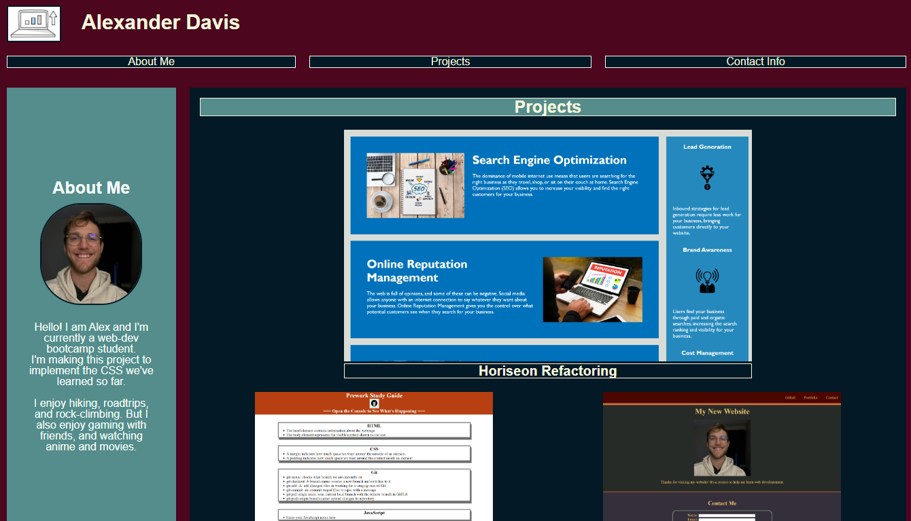

# Portfolio-02-challenge
Beginner Bootcamp Portfolio 

## Description
Webpage portfolio initially populated with previous homework projects as examples of coding ability. Will serve as a template or base for future portfolio when more examples are created / more code knowledge is able to be showcased. Currently displays one main project and two additional projects of smaller size. 
 

### Webpage

 
URL: [Portfolio github page](https://acd74982306.github.io/Portfolio-02-challenge)
GitHub: [Portfolio github repo](https://github.com/acd74982306/Portfolio-02-challenge)

## Author
Alexander Davis

## License
MIT License

##
Laptop place-holder icon
* ["Set of doodle icons ..."](https://stock.adobe.com/images/set-of-doodle-icons-briefcase-envelope-with-mail-steaming-cup-pie-chart-notepad-with-pen-purse-with-money-calculator-scheme-files-folders-magnifier-business-signs-linear-vector-illustration/478244262?as_campaign=ftmigration2&as_channel=dpcft&as_campclass=brand&as_source=ft_web&as_camptype=acquisition&as_audience=users&as_content=closure_asset-detail-page)
* by [klyaksun](https://stock.adobe.com/contributor/205133094/klyaksun)
* Adobe Stock - Standard license
